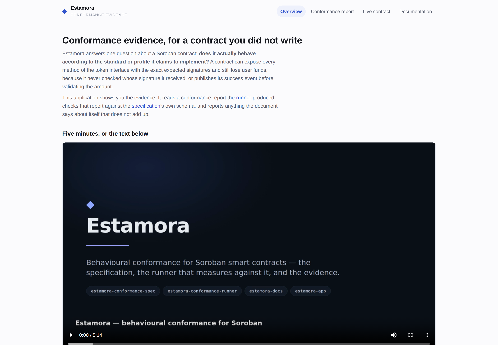
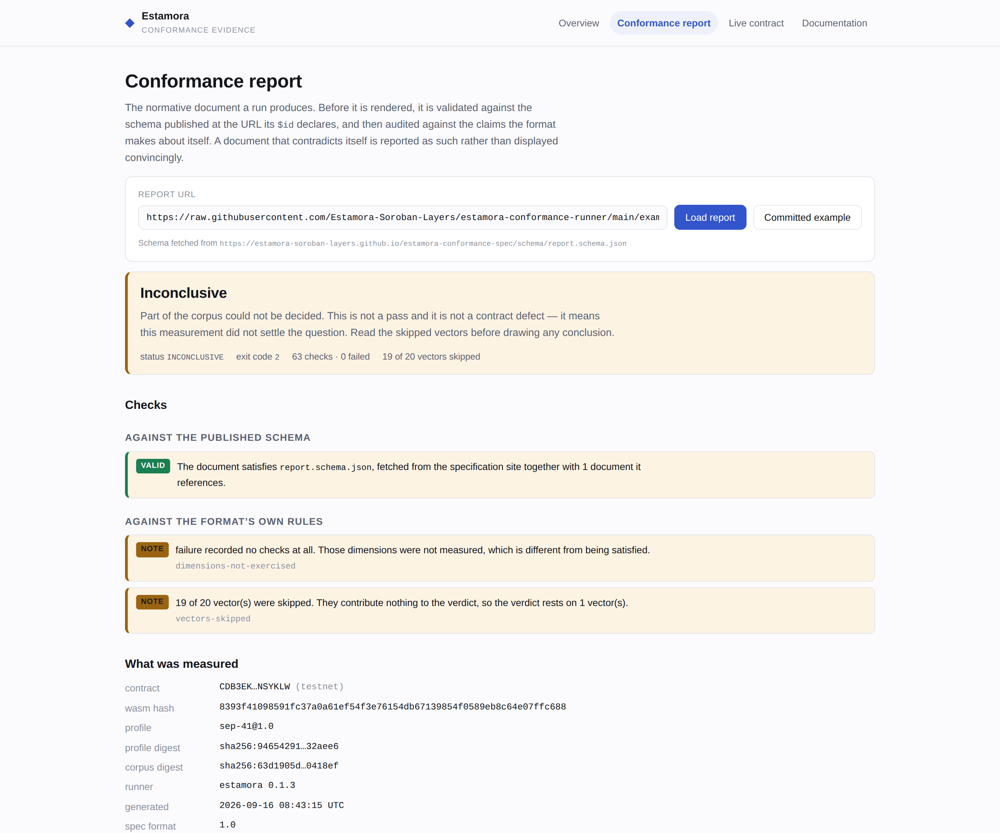
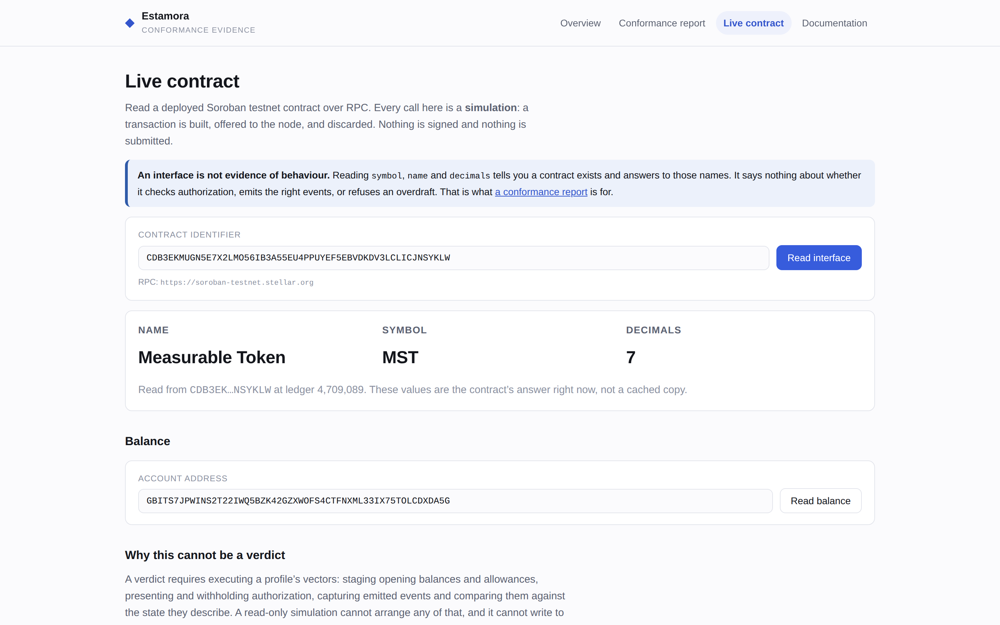
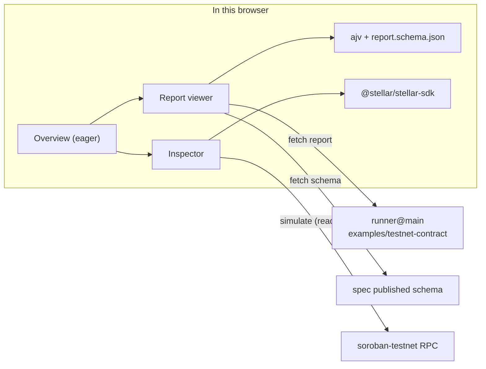

# estamora-app

**The Estamora web application: conformance evidence for a Soroban contract you did not write.**

[](https://github.com/Estamora-Soroban-Layers/estamora-app/actions/workflows/ci.yml)
[](https://estamora-app.vercel.app)
[](https://estamora-docs.vercel.app)
[](https://estamora-docs.vercel.app/assets/estamora-pitch.mp4)
[](#test-coverage)
[](LICENSE)

**Open it: <https://estamora-app.vercel.app>**

<a href="https://estamora-docs.vercel.app/assets/estamora-pitch.mp4">
  
</a>

**[Watch the five-minute pitch](https://estamora-docs.vercel.app/assets/estamora-pitch.mp4)** — this
application appears in it, and every frame of it was captured from the deployed sites and the
release binary rather than mocked up. The landing page also embeds the player directly, and
`npm run check:browser-fetchable` asserts it is served as `video/mp4` with byte-range support —
without which a browser offers a download instead of playing the file.

## It reads results. It cannot produce a verdict.

That sentence is the design, and it is enforced rather than merely stated.

A conformance verdict is produced by executing a profile's vectors against a contract over RPC, and
it names a profile revision and a corpus of vectors. Only
[`estamora-conformance-runner`](https://github.com/Estamora-Soroban-Layers/estamora-conformance-runner)
does that. This application presents the evidence it produces. An interface read here is not
evidence of behaviour, and a page that made it look like one would be worse than no page.

Concretely, that means **this repository contains no code that submits a transaction.** Every
contract call here is a simulation: a transaction is built, offered to a node, and discarded. There
is nothing to sign and no key to leak, because there is no signing path — not disabled, absent.

## What it does

| View                   | What it answers                                                                     |
| ---------------------- | ----------------------------------------------------------------------------------- |
| **Overview**           | What Estamora is, and what this application is not                                  |
| **Conformance report** | Loads a report, validates it against the published schema, then audits it           |
| **Live contract**      | Reads a deployed testnet contract over Soroban RPC: symbol, name, decimals, balance |
| **Documentation**      | The guides and the reference, integrated rather than linked away                    |

### What it looks like

Every screenshot below is captured from [the deployment](https://estamora-app.vercel.app), not from
a development server, by
[`capture-readme-shots.mjs`](https://github.com/Estamora-Soroban-Layers/estamora-docs/blob/main/video/capture-readme-shots.mjs).
That script waits for each view to have actually produced content — the report has to be fetched and
validated, and the contract read has to come back over RPC — so none of these is a picture of a
loading state.

**Overview.** The claim first, stated as a boundary: this reads results, it cannot produce a
verdict.



**Conformance report.** The worked example, opened and audited against the published schema. 63
checks over seven dimensions, and the reason the run is `INCONCLUSIVE` rather than `CONFORMANT`
stated in the page itself: of the 20 vectors in the corpus, 1 executed and passed and 19 were
skipped, because a read-only target cannot stage the authorization and the opening state they
require.



**Live contract.** A real read against a deployed testnet contract, performed by simulation. The
result is deliberately modest — a symbol, a name and a decimals count — because that is all a read
can establish.



## The audit, which is the interesting part

Rendering a report beautifully is only useful if the report is trustworthy, and a document that
contradicts itself has already told two different stories. So the application checks a report
against the claims the format makes about itself **before** presenting it, and shows what it found
above the report rather than behind a details tag.

A **defect** means the document contradicts itself:

| Rule                                  | Why it matters                                                                                                                             |
| ------------------------------------- | ------------------------------------------------------------------------------------------------------------------------------------------ |
| `exit-code-disagrees-with-status`     | A CI system reads the exit code and a reader reads the status. They must agree.                                                            |
| `vector-count-disagrees-with-results` | `vectors.count` and `results.length` are two statements about the same thing.                                                              |
| `dimension-missing-from-summary`      | A dimension with no checks is reported as a zero, never omitted, so absence means the summary is incomplete.                               |
| `dimension-total-inconsistent`        | `total` must equal `passed + failed`.                                                                                                      |
| `undecided-vector-without-diagnostic` | "This was not exercised" and "this held" are different claims, and conflating them is the failure mode this whole project exists to catch. |
| `conformant-with-failed-vectors`      | A conformant verdict over a failed vector.                                                                                                 |
| `non-conformant-without-a-failure`    | The verdict names the contract, but nothing says which requirement it violated.                                                            |
| `digest-not-a-digest`                 | Without a digest, the verdict cannot be tied to a revision of the requirements.                                                            |
| `profile-version-absent`              | `sep-41` is incomplete; `sep-41@1.0` is a claim.                                                                                           |

A **note** means the report is telling the reader something they must not skim past —
`dimensions-not-exercised`, or `vectors-skipped`. These exist because _"0 failed"_ reads as
_"everything was checked"_, and usually that is not what happened.

## Why the worked example is not conformant

The default report is a real measurement the runner made over RPC against a contract deployed to
Soroban testnet, committed to the runner rather than described in prose. It reports **63 checks
across all seven dimensions, 0 failed** — and it is `INCONCLUSIVE`, not `CONFORMANT`, because 19 of
its 20 vectors need seeded state that a read-only measurement of a deployed contract cannot arrange.

That is the single most misreadable thing about a conformance report, so this application leads with
it: the two notes above are produced by the audit and displayed for exactly this document.

## The specification is fetched, not copied

`report.schema.json` is **not** vendored here. It is fetched from the URL its `$id` declares —
<https://estamora-soroban-layers.github.io/estamora-conformance-spec/schema/report.schema.json> —
together with `profile.schema.json`, which it references. A copy would be a second answer to "what
is a valid report", and it would go stale exactly when it mattered.

Fetching both is also what demonstrates that both `$id`s resolve on the published site, which is the
property a consumer's validator depends on.

If the schema cannot be fetched, the application says so and labels the report **unvalidated**
rather than silently skipping the check — an unchecked report presented with the same confidence as
a checked one is worse than showing nothing.

## Running it

Requires Node.js 22.12 or later.

```bash
npm ci
npm run dev          # http://localhost:5173
```

| Script                  | Does                                             |
| ----------------------- | ------------------------------------------------ |
| `npm run dev`           | Development server                               |
| `npm run build`         | Type-check and build to `dist/`                  |
| `npm run typecheck`     | `tsc --noEmit`                                   |
| `npm run format:check`  | Prettier, checked not applied                    |
| `npm test`              | Vitest, offline                                  |
| `npm run test:coverage` | The same suite, with the coverage floor enforced |
| `npm run verify:report` | The cross-repository check (needs the network)   |
| `npm run ci`            | Everything CI runs, in CI order                  |

No unit test reaches the network. Every one is a pure function of its input, so a red build always
means the code changed. The single network-dependent check is `verify:report`, which runs as its own
CI job where its failure is unambiguous.

## Checks

Eight job-level checks. Each fails for a different reason, so a red build names the problem rather
than pointing at one long job.

| Job             | Enforces                                                                                                                                                                                                                   |
| --------------- | -------------------------------------------------------------------------------------------------------------------------------------------------------------------------------------------------------------------------- |
| `verify`        | Formatting, types, tests with the coverage floor, build — and that the **initial bundle stays under 400 kB** and is free of `stellar-sdk` and `ajv`, because code-splitting is a claim about the build output              |
| `normative`     | The runner's committed report still validates against the specification's published schema, and still reports the 63/0/`INCONCLUSIVE` figures this application states                                                      |
| `links`         | Every documentation URL this application sends a reader to resolves                                                                                                                                                        |
| `claims`        | Nothing in shipped source signs or submits, mainnet is absent, and no credential is committed — the three claims the README makes, which are enforced by the _absence_ of code and so are the easiest to break by accident |
| `licences`      | Every **runtime** dependency is under a licence this project can ship, read from the lockfile rather than from `node_modules`                                                                                              |
| `hardening`     | Every workflow job declares a timeout and explicit permissions, and no workflow uses `pull_request_target`                                                                                                                 |
| `readme`        | Every link in this README resolves — a different list from the one `links` checks, and the one that rots first                                                                                                             |
| `deploy-vercel` | Publishes the artefact CI built, then asserts the shell, the entry chunk, **CORS from the deployed origin** to all three cross-origin sources, and that the pitch video streams as `video/mp4` with byte-range support     |

The two static checks (`claims`, `hardening`) deliberately run without `npm ci`: they are searches,
and a check that runs in a second on an empty runner is one that cannot fail for an unrelated
reason.

The CORS check exists because those three fetches happen in a browser. A missing
`access-control-allow-origin` would present as "the application is broken" with no useful clue;
asserting it after every deploy turns that into a named failure.

## Test coverage

Measured with `npm run test:coverage`, over **every** file in `src/` rather than only the ones a
test happens to import:

| Metric     | Measured | Floor enforced in CI |
| ---------- | -------- | -------------------- |
| Statements | 96.9%    | 92%                  |
| Lines      | 97.9%    | 93%                  |
| Functions  | 94.7%    | 90%                  |
| Branches   | 88.4%    | 82%                  |

`src/lib/` — the report model, the audit, the schema loader and the RPC read path — is at 97.7%. The
views are at 98.2%.

The scope matters more than the figure. `coverage.include` is set to `src/**/*.{ts,tsx}`, because
without it the provider counts only the modules a test loaded, and a suite that tests two files
reports a high number over those two. That is not a hypothetical: before this was configured the
same suite reported **97%** over the two files it happened to import and **34%** over the
application.

The floor is enforced by `vitest run --coverage` in CI, so a module that loses its tests fails the
`verify` job rather than lowering a number somebody has to notice. It sits below the measured
figures so ordinary refactoring does not fail the build.

The RPC read path is additionally verified against the **deployed** application in a real browser,
because it is the one part whose behaviour depends on the bundled Stellar SDK rather than on this
repository's code alone.

## Architecture



Static site, no server, no environment variables, no secrets at runtime. `stellar-sdk` and `ajv` are
loaded on demand: initial load is **243 kB** (77 kB gzipped) instead of 946 kB (232 kB), because
somebody who opens this site to read what a verdict _means_ should not have to download a Stellar
client to find out.

## Contributing

See [`CONTRIBUTING.md`](CONTRIBUTING.md). The rule that shapes most changes: everything this
application _states_ about the format lives in `src/lib/report.ts` as a checkable rule, not as prose
in a template.

## Security

See [`SECURITY.md`](SECURITY.md).

## License

Apache-2.0. See [`LICENSE`](LICENSE).
