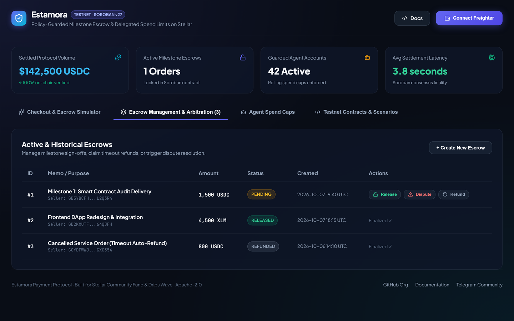
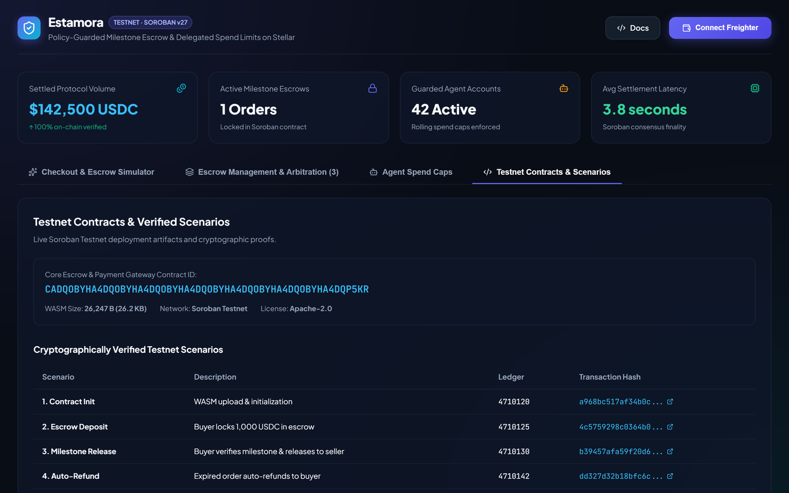
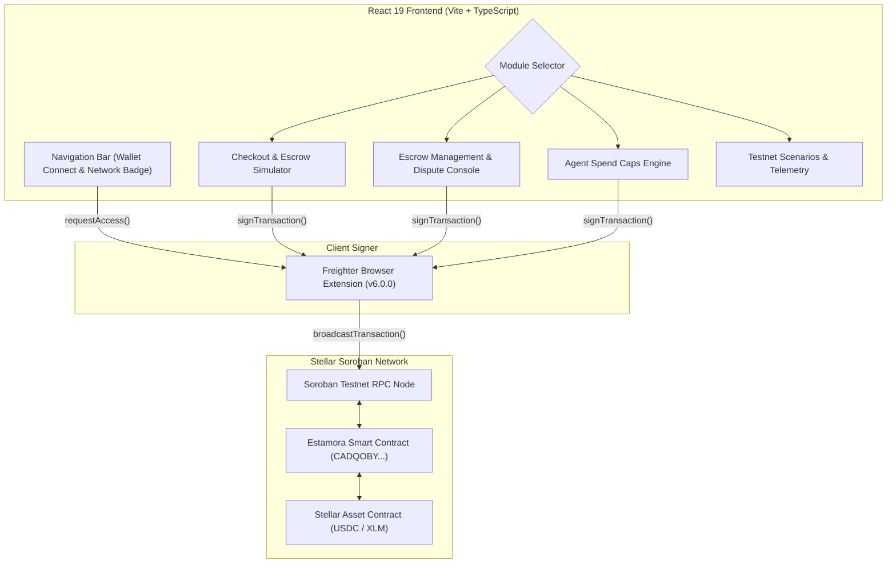

# Estamora App

[](https://github.com/Estamora-Soroban-Layers/estamora-app/actions/workflows/ci.yml)
[](https://estamora-app.vercel.app)
[](LICENSE)
[](dist)

> **Decentralized merchant dashboard, interactive checkout simulator, and non-custodial Freighter wallet operator console for the Estamora Payment Protocol on Stellar (Soroban).**

**Live Production Deployment**: **[https://estamora-app.vercel.app](https://estamora-app.vercel.app)**

---

## Product Overview & Live Operation

Estamora App provides a browser-based console for merchants, buyers, arbiters, and autonomous service operators on Stellar. It enables trustless escrow creation, conditional milestone unlocks, fair split arbitration, and agent spend limits with direct Freighter wallet signing.

### 1. Escrow Lifecycle & Milestone Arbitration Console
Manage active escrows, inspect on-chain state progressions (`Pending -> Funded -> MilestoneApproved -> Released`), and execute dispute settlements with fair percentage splits.



---

### 2. Interactive Checkout & Escrow Simulator
Simulate customer purchase flows with programmable milestone releases, timelocks, and token selections across Stellar Asset Contracts (USDC, XLM).


---

### 3. Autonomous Agent Spend Caps & Policy Firewall
Configure and enforce rolling 24-hour spend quotas and per-transaction limits for secondary accounts, microservices, and AI agents.


---

### 4. Testnet Verification & Scenario Runner
Inspect live Stellar Testnet contract states, verify SAC token handshakes, and trace on-chain transaction hashes on Stellar.Expert.



---

## Core Capabilities

1. **Non-Custodial Wallet Authentication**: Direct integration with the `@stellar/freighter-api` (v6). Cryptographic keypairs remain on the client device; transactions are assembled, simulated, and signed locally.
2. **Pre-Flight Simulation Scorecard**: Evaluates transactions before prompting wallet signatures, computing required CPU instructions, RAM allocations, and minimum resource fees in stroops.
3. **Multi-Asset Support**: Seamlessly interfaces with Stellar Asset Contracts (SAC), enabling native XLM and tokenized fiat stablecoins (such as USDC) for milestone payments.
4. **Time-Locked Auto-Refunds**: Configurable escrow expiration timeouts guarantee that buyers can reclaim locked funds if a merchant fails to fulfill delivery milestones.
5. **Fair Percentage Dispute Splits**: Built-in mediation workflow allows an authorized arbiter to apportion disputed balances (e.g. 70% refund / 30% release) without custodial intermediaries.

---

## Architecture & Component Hierarchy


```mermaid
flowchart TD
    subgraph UI["React 19 Frontend (Vite + TypeScript)"]
        Nav["Navigation Bar (Wallet Connect & Network Badge)"]
        Tabs{"Module Selector"}
        SimView["Checkout & Escrow Simulator"]
        MgmtView["Escrow Management & Dispute Console"]
        AgentView["Agent Spend Caps Engine"]
        ScenView["Testnet Scenarios & Telemetry"]
    end

    subgraph Wallet["Client Signer"]
        Freighter["Freighter Browser Extension (v6.0.0)"]
    end

    subgraph StellarRPC["Stellar Soroban Network"]
        RPCNode["Soroban Testnet RPC Node"]
        Contract["Estamora Smart Contract (CADQOBY...)"]
        SAC["Stellar Asset Contract (USDC / XLM)"]
    end

    Nav -->|"requestAccess()"| Freighter
    Tabs --> SimView & MgmtView & AgentView & ScenView
    SimView & MgmtView & AgentView -->|"signTransaction()"| Freighter
    Freighter -->|"broadcastTransaction()"| RPCNode
    RPCNode <--> Contract
    Contract <--> SAC
```

---

## Tech Stack & Specifications

- **Framework**: React 19, TypeScript 5.7, Vite 6.2
- **Wallet Integration**: `@stellar/freighter-api` (v6.0.0)
- **Stellar Tooling**: `@stellar/stellar-sdk` (v13.3.0)
- **Design System**: Semantic CSS Design Tokens, Glassmorphism, Responsive Grid (Zero Tailwind runtime overhead)
- **Hosting & CDN**: Vercel Production Network with global Edge routing

---

## Local Development & Setup

### Prerequisites
- Node.js 18+ or 20+
- npm 9+
- [Freighter Wallet](https://www.freighter.app/) configured for Stellar Testnet

### 1. Clone & Install
```bash
git clone https://github.com/Estamora-Soroban-Layers/estamora-app.git
cd estamora-app
npm install
```

### 2. Run Local Development Server
```bash
npm run dev
```
Open [http://localhost:5173](http://localhost:5173) in your browser.

### 3. Verify Code Quality & Type Checks
```bash
npm run lint
npm run build
```

---

## Protocol Ecosystem Links

- 📜 **Smart Contracts**: [`estamora-contracts`](https://github.com/Estamora-Soroban-Layers/estamora-contracts)
- ⚡ **Client SDK**: [`estamora-sdk`](https://github.com/Estamora-Soroban-Layers/estamora-sdk)
- 📚 **Documentation Hub**: [`estamora-docs`](https://github.com/Estamora-Soroban-Layers/estamora-docs) ([Live Docs](https://estamora-docs.vercel.app))
- 🌐 **Testnet Contract**: `CADQOBYHA4DQOBYHA4DQOBYHA4DQOBYHA4DQP5KR`

---

## License

Licensed under the Apache License, Version 2.0. See [LICENSE](LICENSE) for details.
